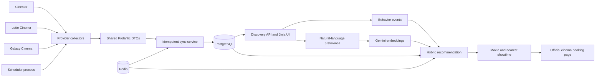

# Movie Discovery & Recommendation Platform

A multi-cinema discovery platform that aggregates movie schedules from
Cinestar, Lotte Cinema, and Galaxy Cinema, resolves provider-specific records
into a canonical catalogue, and recommends movies that still have relevant
showtimes.

The primary product flow is **discovery and external booking**: users compare
movies, cinemas, dates, and locations in one interface, then continue to the
cinema's official booking page. The repository also contains an optional
internal-booking subsystem used to demonstrate real-time seat holds and
double-booking prevention.

## Why this project exists

Cinema chains expose schedules through different web applications, identifiers,
and response formats. The same movie may appear under several names and IDs,
while users must repeatedly search across provider websites to compare
showtimes.

This project addresses that fragmentation with four stages:

1. Collect provider-specific cinema and showtime data.
2. Normalize it into a shared ingestion contract.
3. Resolve duplicate provider movies into one canonical movie.
4. Rank currently available movies using user behavior, semantic intent, and
   cinema proximity.

## System overview



## Core capabilities

### Multi-provider ingestion

Each cinema chain is implemented as a provider adapter behind a shared
`CinemaCollector` interface:

- **Cinestar** discovers public Next.js movie/cinema data and queries showtime
  endpoints for a date range.
- **Lotte Cinema** integrates with the site's ASP.NET RPC endpoints for cinema
  details, movie dates, and play sequences.
- **Galaxy Cinema** normalizes the schedule embedded in the public Next.js page;
  its anti-bot layer may require an operator-supplied browser cookie.

Live collectors fetch seven days by default and normalize their results into
shared Pydantic DTOs before any database write. They include request throttling
and retries for transient upstream failures.

### Idempotent synchronization and canonical movies

Provider records are identified by `(source, external_id)`, so rerunning a
collector updates existing data instead of creating duplicate cinemas or
showtimes. Every record is synchronized inside a database savepoint: one bad
record is reported without rolling back the valid records in the batch.

The catalogue separates:

- `Movie`: the canonical movie shown to users;
- `ProviderMovie`: the provider-specific ID and metadata;
- `Showtime`: a schedule linked to both the canonical and provider movie.

Existing provider mappings take priority. New records are matched using a
normalized title and a duration tolerance, allowing one movie card to aggregate
showtimes from multiple cinema chains while preserving source provenance.

### Collector observability and data freshness

Every synchronization attempt is persisted in `collector_runs` with its source,
status, duration, requested date range, record counts, and any operational
error. A zero-record response is classified as `suspicious` rather than a
successful refresh, while batches with both valid and invalid records are
classified as `partial_failure`.

The homepage and `GET /collectors/freshness` expose the last successful update
for Cinestar, Lotte, and Galaxy. Freshness is calculated independently from the
latest attempt, so a failed run can raise a warning without discarding the last
known showtimes or falsely marking them as newly updated. The default freshness
window is eight hours and can be changed with
`COLLECTOR_FRESHNESS_HOURS`.

### Discovery and nearby cinemas

The API and server-rendered UI support:

- movie title, provider, city, and date filters;
- upcoming-showtime filtering and pagination;
- showtime aggregation across providers;
- browser geolocation and radius filtering;
- nearest-cinema ordering with Haversine distance;
- external redirects to official booking pages.

Haversine distance is used because the product currently needs geographic
proximity, not road routing or travel-time estimates. No Google Maps API is
required for this flow.

### Behavior-based recommendation

Authenticated users generate explicit discovery events such as:

- `movie_viewed`
- `movie_searched`
- `showtimes_viewed`
- `external_booking_clicked`
- `preference_prompt_submitted`
- `recommendation_clicked`

Events are validated against catalogue entities and deduplicated within a
two-minute window. Older signals decay with a 30-day half-life. An external
booking click is intentionally stored as **intent**, not as a confirmed ticket
purchase, because the transaction occurs on the provider's website.

### Gemini-powered semantic recommendation

An authenticated user can describe a viewing preference in natural language,
for example:

> I want a light, funny family movie that is not too violent.

`POST /recommendations/natural-language` first limits candidates to movies with
eligible showtimes. Gemini then embeds the prompt and canonical movie documents;
the service compares them with cosine similarity and combines semantic relevance
with behavioral and catalogue signals.

Without location:

```text
semantic 60% + behavior 25% + showtime popularity 10% + rating 5%
```

With location:

```text
semantic 55% + behavior 20% + proximity 15% + popularity 5% + rating 5%
```

Movie embeddings are cached in PostgreSQL by model and content hash. Prompt
embeddings are cached in Redis by a hash of the normalized prompt, so repeated
requests do not expose raw prompts in Redis keys. If Gemini is not configured or
temporarily fails, the recommender falls back to local word/character TF-IDF.

### Redis in the primary workflow

Redis is used for production-facing concerns rather than as a decorative
dependency:

- atomic daily AI quotas per authenticated user and hashed IP;
- prompt-embedding cache with TTL;
- token-owned distributed locks for scheduled collectors;
- expiring password-reset tokens.

The quota and lock operations use Lua scripts where multiple Redis commands must
behave atomically. If Gemini is configured and Redis is unavailable, the
recommendation endpoint fails closed to protect API cost.

### Scheduled synchronization

Collectors can run in a dedicated long-lived scheduler process that shares the
application image, PostgreSQL, and Redis without sharing the FastAPI process.
By default, each provider runs every six hours; Cinestar starts immediately,
Lotte is offset by ten minutes, and Galaxy by twenty minutes. Provider failures
are logged and persisted in `collector_runs` without stopping the other loops.

The interval, stagger, date range, and enabled sources are environment-driven:

```dotenv
COLLECTOR_SCHEDULER_SOURCES=cinestar,lotte,galaxy
COLLECTOR_SCHEDULE_INTERVAL_MINUTES=360
COLLECTOR_STAGGER_MINUTES=10
COLLECTOR_SYNC_DAYS=7
```

### Optional internal-booking concurrency lab

Real provider showtimes use `external_redirect`; this application cannot know
their live seat inventory or confirm purchases without private booking APIs.

For concurrency testing, `ENABLE_INTERNAL_BOOKING=true` activates a separate
internal flow with:

- Redis `SET NX EX` seat holds with a five-minute TTL;
- a maximum of ten held seats per user and showtime;
- WebSocket seat-state broadcasts and reconnecting clients;
- PostgreSQL `SELECT ... FOR UPDATE` during booking confirmation;
- database constraints as the final consistency boundary.

Redis coordinates temporary state and real-time feedback; PostgreSQL remains the
source of truth for confirmed bookings.

## Technology stack

| Area | Technology |
|---|---|
| Backend | Python 3.12, FastAPI, async SQLAlchemy, Pydantic |
| Database | PostgreSQL, Alembic |
| Cache and coordination | Redis, Lua scripts |
| Recommendation | Gemini Embedding 2, scikit-learn TF-IDF, cosine similarity |
| Frontend | Jinja2, HTML, CSS, browser Geolocation API, WebSockets |
| Data collection | HTTPX, provider adapters, public web data |
| Authentication | JWT in HttpOnly cookies, bcrypt |
| Infrastructure | Docker, Docker Compose |
| Testing | pytest, pytest-asyncio, isolated PostgreSQL and Redis services |

## Data model

```text
User 1 ── N UserEvent
User 1 ── N Booking

Movie 1 ── N ProviderMovie
Movie 1 ── N Showtime
CollectorRun N ── 1 provider source (logical association)
Cinema 1 ── N CinemaRoom
Cinema 1 ── N Showtime
CinemaRoom 1 ── N Seat

Showtime N ── N Seat          through ShowtimeSeat
Booking  N ── N ShowtimeSeat  through BookingSeat
```

## Getting started

### Prerequisites

- Docker Engine
- Docker Compose v2
- A Gemini API key only if semantic embeddings are required; local TF-IDF works
  without one

### 1. Configure the environment

```bash
cp .env.example .env
```

Generate a development JWT secret and place it in `SECRET_KEY`:

```bash
python -c "import secrets; print(secrets.token_hex(32))"
```

Optional Gemini configuration:

```dotenv
GEMINI_API_KEY=your-google-ai-studio-api-key
GEMINI_EMBEDDING_MODEL=gemini-embedding-2
GEMINI_API_BASE_URL=https://generativelanguage.googleapis.com/v1beta
```

TMDB is the only source used for canonical movie ratings. Configure its API
key to enrich cinema movies after every collector synchronization:

```dotenv
TMDB_API_KEY=your-tmdb-api-key
```

The matcher uses normalized titles and runtime tolerance. A movie without a
confident TMDB match or without TMDB votes is displayed as `Chưa đánh giá`.

Never commit `.env`; it is intentionally excluded by `.gitignore`.

### 2. Start the application

```bash
docker compose up --build
```

The development compose command applies Alembic migrations before starting
Uvicorn.

- Application: <http://localhost:8001>
- OpenAPI documentation: <http://localhost:8001/docs>
- Health check: <http://localhost:8001/health>

### 3. Run live collectors

```bash
docker compose run --rm app \
  python -m app.scripts.sync_cinema_data --source cinestar

docker compose run --rm app \
  python -m app.scripts.sync_cinema_data --source lotte

docker compose run --rm app \
  python -m app.scripts.sync_cinema_data --source galaxy
```

Override the starting date and range when necessary. Live collectors support
between 1 and 31 days:

```bash
docker compose run --rm app \
  python -m app.scripts.sync_cinema_data \
  --source cinestar --date 2026-08-21 --days 7
```

Galaxy may require browser-derived values from a current `/lich-chieu/`
request. Keep these values in environment variables, never in source control:

```bash
docker compose run --rm \
  -e GALAXY_COOKIE='muid_mly=...' \
  -e GALAXY_USER_AGENT='Mozilla/5.0 ...' \
  app python -m app.scripts.sync_cinema_data \
  --source galaxy --days 7
```

Upstream websites can change without notice. These collectors use public-facing
data for an educational portfolio project and should be run at a respectful
frequency and in accordance with the applicable site terms.

To backfill or refresh TMDB ratings for movies already stored in the database:

```bash
docker compose run --rm app \
  python -m app.scripts.enrich_tmdb_ratings
```

### 4. Start the scheduler

The scheduler is opt-in locally so that starting the web application does not
unexpectedly contact upstream cinema websites:

```bash
docker compose --profile scheduler up --build
```

This starts the normal application services plus a separate
`movie-booking-scheduler` container. To execute all configured providers once
and exit, use:

```bash
docker compose run --rm scheduler \
  python -m app.scripts.run_collector_scheduler --once
```

Use the long-running scheduler on a VPS or Docker host. On a managed platform,
the same `sync_cinema_data` commands can instead be configured as independent
native cron jobs.

## Database migrations

Alembic owns the database schema; application startup does not call
`Base.metadata.create_all()`.

```bash
docker compose run --rm app alembic upgrade head
docker compose run --rm app alembic current
docker compose run --rm app alembic check
```

The migration chain supports both an empty database and the repository's legacy
booking schema, including data backfills and integrity checks.

## API examples

```text
GET  /movies?title=conan&source=cinestar&available_only=true&skip=0&limit=20
GET  /showtimes?source=lotte&city=H%E1%BB%93%20Ch%C3%AD%20Minh&date=2026-08-21
GET  /movies/{movie_id}/showtimes?city=H%E1%BB%93%20Ch%C3%AD%20Minh&date=2026-08-21
GET  /cinemas?latitude=10.778&longitude=106.702&radius_km=10
GET  /collectors/freshness
POST /events
GET  /recommendations/me
POST /recommendations/natural-language
```

Interactive request and response schemas are available through `/docs`.

## Testing

The test profile uses isolated PostgreSQL and Redis services and applies all
migrations before pytest starts. It never truncates the development database.

```bash
docker compose --profile test run --rm --build test
```

After the first image build:

```bash
docker compose --profile test run --rm test
```

The suite currently contains 45 tests covering:

- authentication and application smoke tests;
- Cinestar, Lotte, and Galaxy collector contracts;
- idempotent synchronization and canonical movie resolution;
- discovery filters and nearby-cinema calculations;
- event validation and deduplication;
- Gemini request contracts, embedding caches, TF-IDF fallback, and AI quotas;
- distributed collector locks;
- collector run classification and freshness reporting;
- scheduler configuration and provider-failure isolation;
- production database URL and secure-cookie configuration;
- seat holds, inventory consistency, and competing booking requests.

## Project structure

```text
.
├── alembic/                  # Schema migrations and legacy data backfills
├── app/
│   ├── collectors/           # Provider adapters and shared ingestion DTOs
│   ├── core/                 # Configuration, database, Redis, security
│   ├── models/               # SQLAlchemy models
│   ├── routes/               # HTTP and WebSocket endpoints
│   ├── schemas/              # API request/response schemas
│   ├── scripts/              # Collector and concurrency entry points
│   ├── services/             # Sync, discovery, recommendation, email
│   ├── static/               # CSS and client-side behavior
│   ├── templates/            # Jinja2 pages
│   └── main.py               # FastAPI application
├── tests/                    # Tests and recorded provider-response fixtures
├── docker-compose.yml
└── Dockerfile
```

## Current boundaries

- Cinestar, Lotte, and Galaxy are unofficial integrations built from
  public-facing website behavior, not stable partner APIs.
- External providers do not expose live seat inventory or purchase confirmation
  to this project; provider clicks are behavioral intent signals only.
- Nearby ranking uses straight-line distance rather than road distance.
- Embeddings are stored as JSON vectors and scored in application memory, which
  is appropriate for this catalogue size but should move to `pgvector` or a
  vector database at larger scale.
- The optional internal-booking subsystem is a concurrency demonstration and is
  disabled by default in the external-data workflow.

## Potential next steps

- Deploy the web service, PostgreSQL, Redis, and a scheduled collector job.
- Add automated alerts for suspicious or repeatedly failed collector runs.
- Introduce `pgvector` and approximate nearest-neighbor search as the catalogue
  grows.
- Add recommendation evaluation metrics such as click-through rate by context.
- Add a new provider without changing the shared synchronization or discovery
  layers.

## License and data notice

This repository is an educational portfolio project. Movie metadata, cinema
names, schedules, posters, and trademarks remain the property of their
respective owners. Do not use the collectors in ways that violate provider
terms, access controls, or applicable law.
